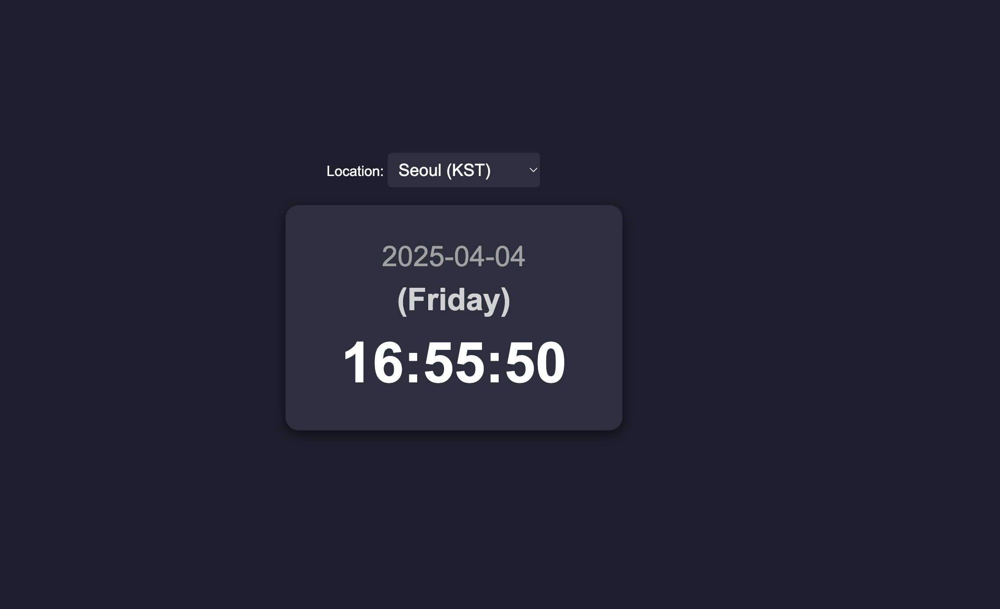

# Clock

## Description
HTML, CSS, JavaScript를 활용하여 날짜와 요일, 시각을 표시하는 시계 제작. 

## 기능
- [v1](./clock_v1/): 기본 시계
- [v2](./clock_v2/): LED 디지털 시계, 타이머 기능, 전체화면 기능

## How To Use
1) repository 다운받기
```
git clone https://github.com/cogito30/js_clock.git
```
2) index.html를 브라우저로 열기

## Result


